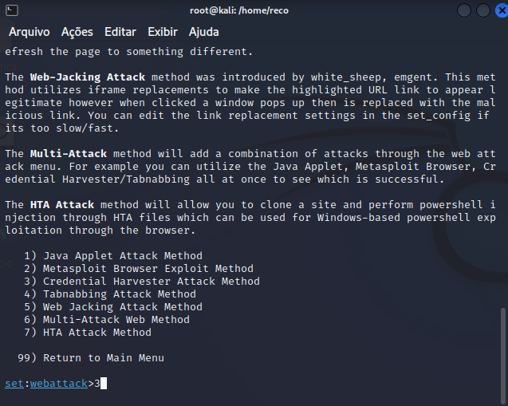

# Criação-de-um-Phishing-com-Kali-Linux

- Acesso root: `sudo su`

- Iniciando o setoolkit: `setoolkit`
- Tipo de ataque: `Social-Engineering Attacks`

- Vetor de ataque: `Web Site Attack Vectors`

- Método de ataque: `Credential Harvester Attack Method `

- Método de ataque: `Site Cloner`

- Método de ataque: `Site Cloner`

- URL para clone: [https://br.linkedin.com](https://br.linkedin.com/)

Pagina clonada aberta 

Dados inseridos na pagina.

Retorno 

